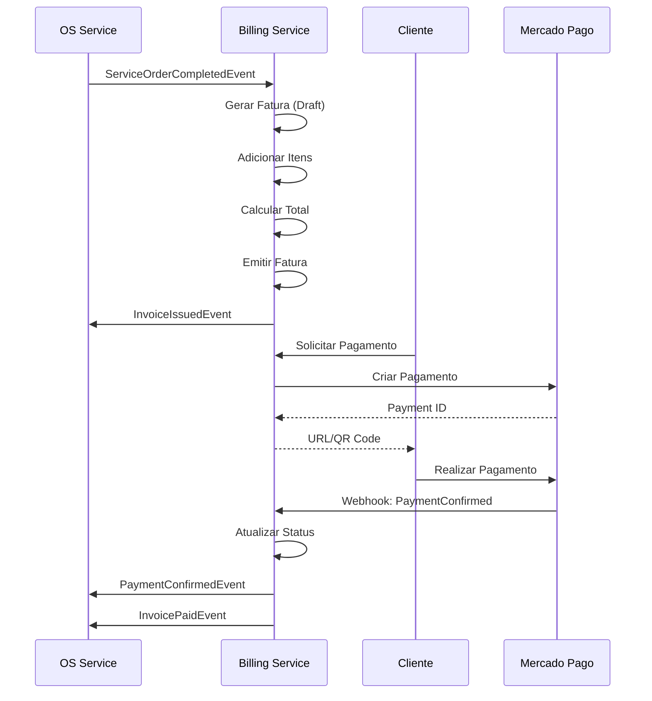

# Billing Service - Smart Workshop

## 📋 Visão Geral

O **Billing Service** é responsável pelo gerenciamento financeiro e faturamento da oficina mecânica Smart Workshop. Este serviço controla a emissão de faturas/notas fiscais e o processamento de pagamentos.

## 🎯 Responsabilidades

- ✅ **Emissão de Faturas/Notas Fiscais**
- ✅ **Gerenciamento de Itens da Fatura**
- ✅ **Processamento de Pagamentos**
- ✅ **Integração com Gateway de Pagamento** (Mercado Pago)
- ✅ **Controle de Status de Pagamento**
- ✅ **Geração de Relatórios Financeiros**
- ✅ **Controle de Inadimplência**

## 🗄️ Banco de Dados

**Tipo:** PostgreSQL  
**Database:** `smart_workshop_billing`

### Entidades

1. **Invoice** - Fatura/Nota Fiscal
   - ServiceOrderId (relação 1:1 com OS Service)
   - ClientId
   - ClientName (desnormalizado)
   - ClientDocument
   - Status (Draft, Issued, Paid, Cancelled, Overdue)
   - IssueDate
   - DueDate
   - PaidDate
   - TotalAmount
   - TaxAmount
   - NetAmount (calculado)
   - Notes
   - Items (itens da fatura)
   - Payments (pagamentos recebidos)

2. **InvoiceItem** - Item da Fatura
   - InvoiceId
   - Description
   - UnitPrice
   - Quantity
   - TotalPrice
   - ItemType (Service, Supply, Labor, Tax)

3. **Payment** - Pagamento
   - InvoiceId
   - Amount
   - Method (Cash, CreditCard, DebitCard, Pix, BankTransfer, Check)
   - Status (Pending, Processing, Approved, Rejected, Cancelled, Refunded)
   - PaymentDate
   - ConfirmedDate
   - TransactionId
   - ExternalPaymentId (ID do Mercado Pago)
   - PaymentProof
   - Notes

## 🔄 Fluxo de Faturamento



## 📡 Eventos Publicados

### InvoiceIssuedEvent

```json
{
  "eventId": "guid",
  "occurredAt": "2026-02-16T00:00:00Z",
  "eventType": "InvoiceIssuedEvent",
  "invoiceId": "guid",
  "serviceOrderId": "guid",
  "clientId": "guid",
  "totalAmount": 850.0,
  "issueDate": "2026-02-16T00:00:00Z",
  "dueDate": "2026-02-23T00:00:00Z"
}
```

### InvoicePaidEvent

```json
{
  "eventId": "guid",
  "occurredAt": "2026-02-16T00:00:00Z",
  "eventType": "InvoicePaidEvent",
  "invoiceId": "guid",
  "serviceOrderId": "guid",
  "clientId": "guid",
  "totalAmount": 850.0,
  "paidDate": "2026-02-16T00:00:00Z"
}
```

### PaymentReceivedEvent / PaymentConfirmedEvent

```json
{
  "eventId": "guid",
  "occurredAt": "2026-02-16T00:00:00Z",
  "eventType": "PaymentConfirmedEvent",
  "paymentId": "guid",
  "invoiceId": "guid",
  "serviceOrderId": "guid",
  "amount": 850.0,
  "confirmedDate": "2026-02-16T00:00:00Z"
}
```

### PaymentFailedEvent

```json
{
  "eventId": "guid",
  "occurredAt": "2026-02-16T00:00:00Z",
  "eventType": "PaymentFailedEvent",
  "paymentId": "guid",
  "invoiceId": "guid",
  "reason": "Saldo insuficiente",
  "failedDate": "2026-02-16T00:00:00Z"
}
```

## 📥 Eventos Consumidos

### ServiceOrderCompletedEvent (OS Service)

Quando uma OS é concluída, o Billing Service:

1. Busca dados da OS no OS Service
2. Busca dados do cliente no Core Service
3. Cria uma fatura automaticamente
4. Adiciona itens baseados no orçamento aprovado
5. Emite a fatura
6. Publica `InvoiceIssuedEvent`

### QuoteApprovedEvent (OS Service)

Pode ser usado para pré-validar valores.

## 🔌 APIs

### Invoices Endpoints

```http
GET /api/invoices
Response: 200 OK
[
  {
    "id": "guid",
    "serviceOrderId": "guid",
    "clientName": "João Silva",
    "status": "Issued",
    "totalAmount": 850.00,
    "issueDate": "2026-02-16T00:00:00Z",
    "dueDate": "2026-02-23T00:00:00Z"
  }
]

POST /api/invoices
Content-Type: application/json
{
  "serviceOrderId": "guid",
  "clientId": "guid",
  "clientName": "João Silva",
  "clientDocument": "12345678901",
  "items": [
    {
      "description": "Troca de Óleo",
      "unitPrice": 150.00,
      "quantity": 1,
      "itemType": "Service"
    },
    {
      "description": "Óleo 5W30 (4L)",
      "unitPrice": 80.00,
      "quantity": 4,
      "itemType": "Supply"
    }
  ],
  "dueDate": "2026-02-23T00:00:00Z"
}
Response: 201 Created

GET /api/invoices/{id}
Response: 200 OK

PUT /api/invoices/{id}/issue
Response: 200 OK

PUT /api/invoices/{id}/cancel
Response: 200 OK

GET /api/invoices/overdue
Response: 200 OK
```

### Payments Endpoints

```http
GET /api/payments
GET /api/payments/{id}

POST /api/payments
Content-Type: application/json
{
  "invoiceId": "guid",
  "amount": 850.00,
  "method": "Pix"
}
Response: 201 Created
{
  "paymentId": "guid",
  "qrCode": "00020126...",
  "qrCodeUrl": "https://..."
}

PUT /api/payments/{id}/confirm
Response: 200 OK

PUT /api/payments/{id}/cancel
Response: 200 OK

PUT /api/payments/{id}/refund
Content-Type: application/json
{
  "reason": "Cliente solicitou devolução"
}
Response: 200 OK

POST /api/webhooks/mercadopago
Content-Type: application/json
{
  "action": "payment.updated",
  "data": {
    "id": "12345678"
  }
}
Response: 200 OK
```

### Reports Endpoints

```http
GET /api/reports/revenue
Query: ?startDate=2026-02-01&endDate=2026-02-28
Response: 200 OK
{
  "period": "2026-02",
  "totalRevenue": 45000.00,
  "paidInvoices": 30,
  "pendingInvoices": 5,
  "overdueInvoices": 2
}
```

## 💳 Integração Mercado Pago

### Fluxo de Pagamento PIX

1. Cliente solicita pagamento via PIX
2. Billing Service cria pagamento no Mercado Pago
3. Mercado Pago retorna QR Code e ID do pagamento
4. Billing Service armazena `external_payment_id`
5. Cliente escaneia QR Code e paga
6. Mercado Pago envia webhook
7. Billing Service valida e confirma pagamento
8. Publica `PaymentConfirmedEvent`

### Webhook Configuration

Configurar no painel do Mercado Pago:

```
URL: https://api.smartworkshop.com/api/webhooks/mercadopago
Events: payment.updated, payment.created
```

## 🏗️ Arquitetura

```
SmartWorkshop.Billing.Api          (ASP.NET Core Web API)
SmartWorkshop.Billing.Application  (Use Cases / CQRS)
SmartWorkshop.Billing.Domain       (Entities / Value Objects / Events)
SmartWorkshop.Billing.Infrastructure (EF Core / Repositories / Mercado Pago Client)
```

## 🚀 Executar Localmente

```bash
# 1. Restaurar dependências
cd smart-workshop-billing-service
dotnet restore

# 2. Configurar connection string e credenciais
# Editar SmartWorkshop.Billing.Api/appsettings.json

# 3. Aplicar migrations
cd SmartWorkshop.Billing.Api
dotnet ef database update

# 4. Executar
dotnet run
```

O serviço estará disponível em: `http://localhost:5003`

## 🔧 Configuração

### appsettings.json

```json
{
  "ConnectionStrings": {
    "BillingDatabase": "Host=localhost;Database=smart_workshop_billing;Username=postgres;Password=postgres"
  },
  "ExternalServices": {
    "CoreServiceUrl": "http://localhost:5001",
    "OSServiceUrl": "http://localhost:5002"
  },
  "MercadoPago": {
    "AccessToken": "YOUR_ACCESS_TOKEN",
    "PublicKey": "YOUR_PUBLIC_KEY",
    "WebhookSecret": "YOUR_WEBHOOK_SECRET"
  },
  "RabbitMQ": {
    "Host": "localhost",
    "Port": 5672,
    "Username": "guest",
    "Password": "guest",
    "Exchange": "smart_workshop_events"
  }
}
```

## 📊 Regras de Negócio

### Cálculo de Impostos

- ISS (Imposto sobre Serviços): 5% sobre serviços
- ICMS: Não aplicado (serviços)

### Prazo de Vencimento

- Padrão: 7 dias após emissão
- Pode ser customizado por cliente

### Status da Fatura

- **Draft**: Fatura criada mas não emitida
- **Issued**: Fatura emitida, aguardando pagamento
- **Paid**: Fatura totalmente paga
- **Overdue**: Fatura vencida e não paga
- **Cancelled**: Fatura cancelada

### Pagamento Parcial

- Permitido pagamento parcial
- Fatura só é marcada como "Paid" quando `soma(payments.amount) >= invoice.totalAmount`

## 📝 Próximos Passos

- [x] Domain Layer (Entities, Value Objects, Events)
- [x] Infrastructure Layer (DbContext)
- [ ] Application Layer (Use Cases)
- [ ] API Layer (Controllers)
- [ ] Repositories Implementation
- [ ] Mercado Pago Integration
- [ ] Event Publishers
- [ ] Event Consumers
- [ ] Webhook Handler
- [ ] Reports Generation
- [ ] Validations
- [ ] Unit Tests
- [ ] Integration Tests

## 👥 Contato

Wellington Macena - RM366131
